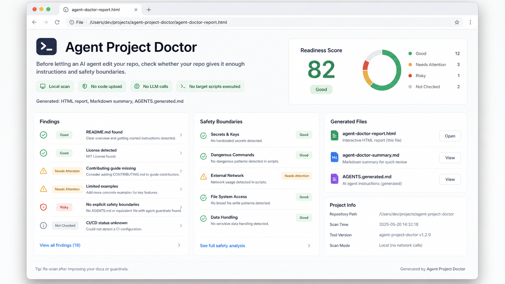

# Agent Project Doctor



Before handing a repo to an AI coding agent, run a quick local checkup.

`agent-project-doctor` is a local TypeScript CLI for maintainers and developers who want to understand whether a repository has enough docs, validation guidance, agent instructions, and safety boundaries for tools like Codex, Claude Code, Cursor, Cline, and similar AI coding agents.

It generates:

- an HTML readiness report
- a Markdown summary
- a draft `AGENTS.generated.md`

No code upload. No LLM calls. No target repo scripts executed.

## Quick Start

Clone and run it locally:

```bash
git clone https://github.com/jiusi1-cpu/agent-project-doctor.git
cd agent-project-doctor
npm install
npm run build
node dist/cli.js scan --path ../your-repo --out ../your-repo/.agent-project-doctor
```

Or scan this project itself after building:

```bash
node dist/cli.js scan --out .agent-project-doctor
```

Generated files:

- `agent-doctor-report.html`
- `agent-doctor-summary.md`
- `AGENTS.generated.md`

The generated `AGENTS.generated.md` is a draft. Review it before copying any guidance into a real `AGENTS.md`.

## Safety Boundaries/Model

The MVP is intentionally local and conservative:

- It does not upload code.
- It does not call LLMs or external APIs.
- It does not execute target repository install/build/test/deploy scripts.
- It does not install target repository dependencies.
- It does not read ordinary source file contents by default.
- It does not read `.env` values.
- It does not write `AGENTS.md`.
- It writes only the three known generated files inside the selected output directory.
- It does not overwrite existing generated outputs unless `--force` is provided.

This is a best-effort readiness signal scanner, not a security certification and not proof that a repository is safe for agents.

## What It Checks

- README and quick-start signals.
- Contribution and license guidance.
- Test command and common test directory signals.
- GitHub Actions workflow presence.
- `AGENTS.md`, `CLAUDE.md`, Cursor rules, and Cline rule signals.
- Missing scope or validation guidance in agent instructions.
- `.env`, `.env.example`, and `.gitignore` safety signals.
- Risky destructive command language.
- Production deploy wording.
- Large repository context warnings.

## What It Does Not Do

- It does not modify source files.
- It does not create pull requests.
- It does not run tests for the target repository.
- It does not perform vulnerability scanning.
- It does not certify a repository as secure or AI-ready.
- It does not publish reports or upload artifacts.

## Example Output

See:

- [`examples/sample-summary.md`](examples/sample-summary.md)
- [`examples/AGENTS.generated.md`](examples/AGENTS.generated.md)
- [`examples/sample-report.html`](examples/sample-report.html)

## Local Development

```bash
npm install
npm test
npm run build
node dist/cli.js scan --path tests/fixtures/minimal-node --out tmp/minimal --force
```

MVP release validation stops at:

```bash
npm pack --dry-run
```

Do not run `npm publish`, create a GitHub Release, push tags, or upload public artifacts unless the project owner explicitly confirms that release step.

## Roadmap

- Improve rule wording and reduce false positives.
- Add more ecosystem-specific command detection.
- Add optional GitHub Action after the CLI MVP is stable.
- Add optional MCP/config scanning after safety wording is mature.

## Contributing

Keep changes small and covered by tests. The scanner must remain local-only by default and must not execute target repository scripts.
